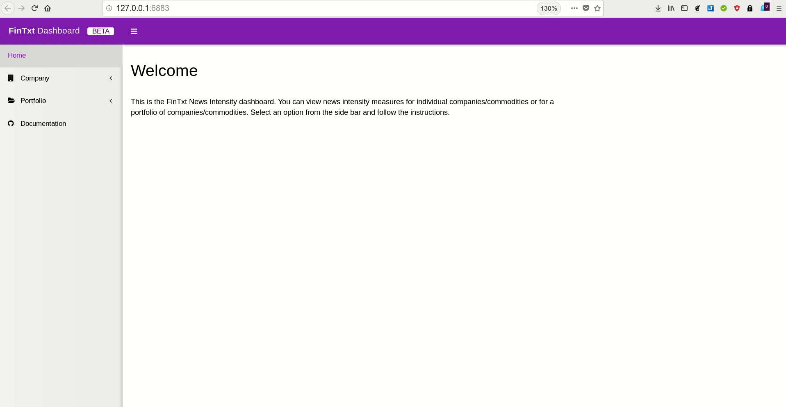
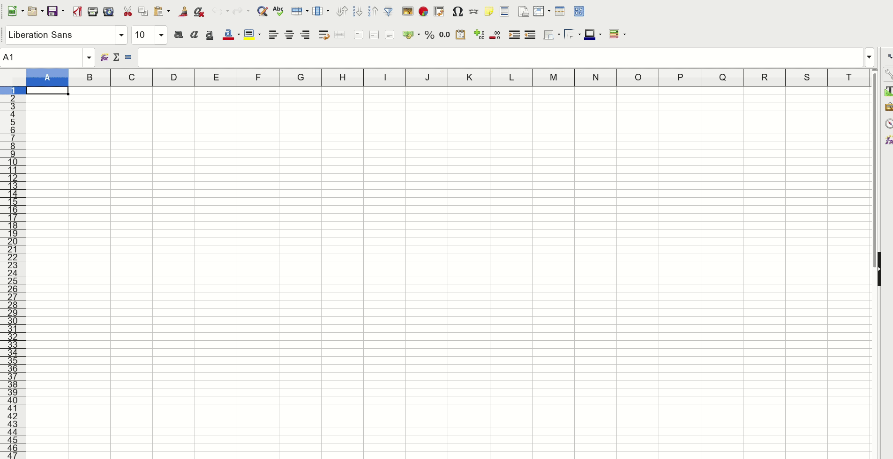
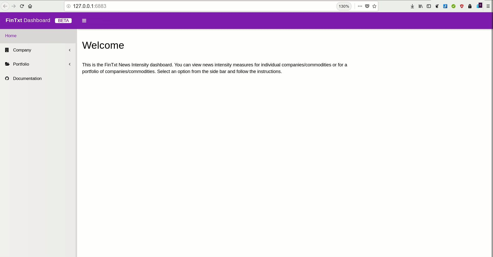
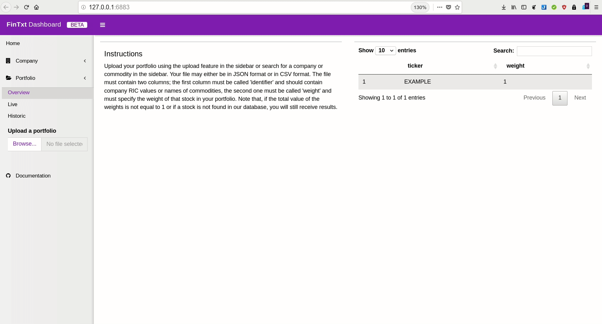

# News Intensity Dashboard {#thedashboard}

The news intensity dashboard is hosted at [https://dashboard.fintxt.io](https://dashboard.fintxt.io/app/FinTxtDashboard) and is only accessible if you have received a username / password combination. Before you read on, you should check out the ['getting started' section](https://fintxt.github.io/documentation/gettinstarted.html).

## Company overview 

After logging in to the dashboard, you can view the submenu's for the 'Company' section by click on the `Company` tab. Enter a commodity name or company RIC into the search bar and select one of the sub categories.



## Portfolio overview

To work with the portfolio overview, you first have to upload a portfolio. This file has to be comma-delimited (CVS).

Your file must contain two columns; the first column must be called 'identifier' (this is where the company RICs or commodity names go) and the second column must be called 'weight' (this is where you specify the percentage in decimal form). 

An example of a portfolio file is given below.

```{r, echo=FALSE, warning=FALSE}
library(magrittr)
df <- data.frame(identifier = c("TRI.TO", "AAPL.OQ", "GOOGL.OQ"), weight = c(0.33, 0.33, 0.33))
knitr::kable(df) %>%
  kableExtra::kable_styling(bootstrap_options = c("striped", "hover"))
```

Next, upload your portfolio using the 'upload' functionality. 



You can now use the portfolio features as shown below.



Note that you cannot mix both commodities and companies in your portfolio. If you try this, you will see the following error:

