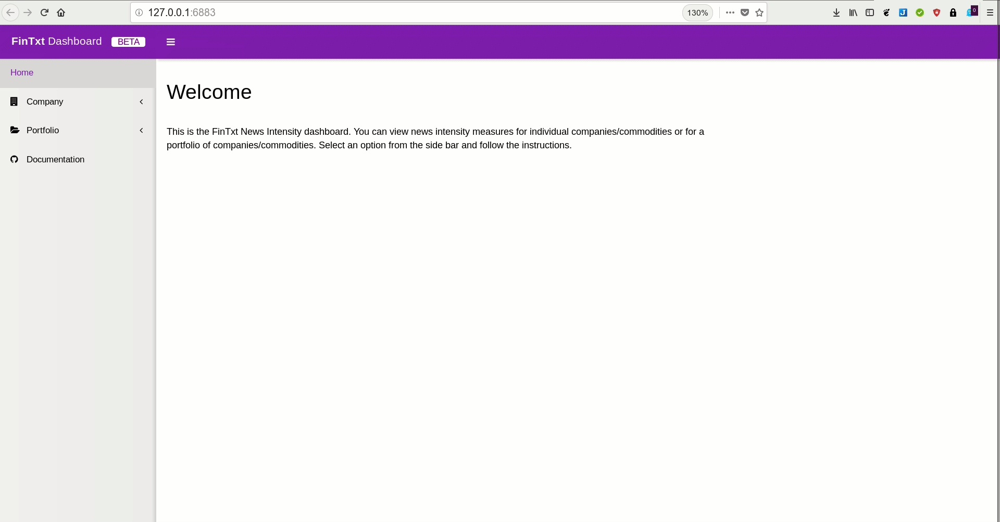

--- 
site: bookdown::bookdown_site
documentclass: book
bibliography: [book.bib, packages.bib]
biblio-style: apalike
link-citations: yes
description: "This document provides documentation about the FinTxt News Intensity API."
---

# Introduction {#intro}

This documentation describes the "news intensity" dashboard and API. These are tools for gauging the amount of relevant media coverage for any asset. That is to say, our news intensities (NI) measure the volume of news stories that are realistically pertinent to an asset, regardless of whether they mention that asset by name.  For example, rare earths are used in making smartphones, therefore a story about rare-earth mining is potentially of relevance to a company manufacturing smartphones, whether or not the company is mentioned in the story. Likewise, Peru is a leader in zinc mining, therefore a story about political turmoil in Peru may have an impact on the prices of zinc futures, whether or not the connection is made in the story itself.

The notion that asset prices are impacted by the nature and extent of media coverage (even when it does not contain new information) has found strong support in the finance literature (e.g. @huberman2001contagious, @engelberg2011causal, @tetlock2011all). By capturing the amount of related media coverage for any asset, NI are expected to have incremental explanatory power for asset price movements. 

The calculation of NI relies on Cortical.io’s multi-lingual semantic fingerprinting technology, which ingests text and outputs its "semantic fingerprint" in the form of a sparse 128x128 matrix of 0s and 1s. Each position in the matrix represents a topic, so that the fingerprint of a text indicates which of the possible 16,384 topics the text is related to. Every day and for every supported language, we obtain the aggregate semantic fingerprint of online news stories from thousands of sources. The count of the relevant stories for each topic is then normalized so that the average normalized value across topics is equal to 1. We also obtain semantic fingerprints for traded assets based on their textual descriptions (@ibriyamova2017using, @ibriyamova2018predicting show that such fingerprints have significant information content). The value of NI for any day/language/asset combination is the average of the normalized article counts across all topics related to the asset in question.

<!--chapter:end:index.Rmd-->

# Getting started {#gettinstarted}

This section contains general information about querying companies and commodities for both the API and the dashboard.

If you have been given an API key, visit the [API](https://fintxt.github.io/documentation/theapi.html) section. If you have been given access to the FinTxt dashboard, visit the [dashboard](https://fintxt.github.io/documentation/thedashboard.html) section. 

## Languages

FinTxt news intensity values are based on news articles. These articles are written in either one of the following languages:

1. English 
2. French
3. German
4. Arabic
5. Russian

When you retrieve news intensities, you can either select one of these languages or opt to use the aggregate of all languages ('total').

## Selecting companies 

When using the API or the dashboard, you should query companies by using their [Reuters Instrument Code](https://en.wikipedia.org/wiki/Reuters_Instrument_Code). 

## Selecting commodities

You can query the API and dashboard for either companies or commodities (but not a mix of both). The following commodities are available:

 - corn
 - oats
 - rice       
 - soybeans   
 - rapeseed   
 - wheat      
 - milk       
 - cocoa     
 - coffee     
 - cotton     
 - sugar      
 - oranges    
 - ethanol    
 - propane    
 - copper     
 - lead      
 - zinc       
 - tin        
 - aluminium
 - nickel     
 - cobalt     
 - molybdenum
 - steel      
 - gold      
 - platinum
 - palladium
 - silver
 - rubber
 - wool
 - amber
 
 

<!--chapter:end:01-gettingstarted.Rmd-->

# News Intensity API {#theapi}

The FinTxt news intensity API is hosted at [https://api.fintxt.io/rest](https://api.fintxt.io/rest). You can view the endpoints and their documentation [here](https://api.fintxt.io/rest/__swagger__/).

The API contains four endpoints:

  1. **languages**: returns a list of available language for which you can query news intensities
  2. **live**: returns live news intensity metrics for a company or commodity and a language
  3. **historic**: returns historic news intensity metrics for a company or commodity, a language and a date 
  4. **portfolio**: returns live or historic news intensity metrics for a weighted portfolio of stocks or commodities, a language and a date.
  
The *language* endpoint can be queried without an API key. The *historic* endpoint can be queried without an API key for dates that go back beyond 30 days on the date of today.

## Basic usage

View the [documentation](https://api.fintxt.io/rest/__swagger__/) for each endpoint for more information about headers and post bodies.

Essentially, you can query each endpoint by building the URL. For example, you want to query the news intensity value for the commodity `wool` on 04-06-2018 for texts written in arabic. Your query would then look as follows:

```text 
languages = 'arabic'
date = '04-06-2018'
endpoint = 'historic'
type = 'commodities'
q = 'wool'
```

You could construct this request using `curl`:

```bash
curl -X GET "https://api.fintxt.io/rest/historic/commodities/arabic/04-06-2018?q=wool" -H  "accept: application/json"
```

You could use `httr` in R:

```R
languages <- 'arabic'
date <- '04-06-2018'
endpoint <- 'historic'
type <- 'commodities'
q <- 'wool'

url <- paste0("https://api.fintxt.io/rest/", endpoint, "/", type, "/", languages, "/", date, "?q=", q)

resp <- httr::GET(url)
httr::content(resp)
```

Or you could use `requests` in Python:

```python
import json
import requests

languages = 'arabic'
date = '04-06-2018'
endpoint = 'historic'
type_ = 'commodities'
q = 'wool'

url = "https://api.fintxt.io/rest/{}/{}/{}/{}?q={}".format(endpoint, type_, languages, date, q)

# Send request 
r = requests.get(url)

# Load response
c = json.loads(r.content)

print(c)
```

But it would be easier to use the clients described below.

## R and Python clients 

You can use the R and Python 3 clients to retrieve data from the API. These clients can be installed from their GitHub repositories.

### R client 

Install the [R client](https://github.com/FinTxt/FinTxtClient-R) by executing

```r
devtools::install_github("FinTxt/FinTxtClient")
```

After installing the package, register your API token by calling the following code:

```r
library(FinTxtClient)
Sys.setenv("FINTXT_CLIENT_TOKEN" = "<yourtoken>")
```

You can now access the various endpoints:

```r
# Set some variables
identifiers = c("TRI.TO", "IBM.N", "RRD.N", "SPGI.N", "INTU.OQ", "RELN.AS", "WLSNc.AS", "REL.L")
weights = c(0.3, 0.1,0.05,0.05, 0.2,0.1,0.1,0.1)
date = "09-07-2018"
type = "companies"
language = "english"

# Load the client
library(FinTxtClient)

# Call the languages endpoint
langs <- fintxt_get_languages()

# Get the live intensity for a stock
one <- fintxt_live_intensities_one(type = type, language = language, q = identifiers[1])
# Same but for commodity
one <- fintxt_live_intensities_one(type = "commodities", language = language, q = "milk")

# Get historic intensity for a stock
one <- fintxt_historic_intensities_one(type = type, language = language,
                                       date = date, q=identifiers[1])
                                       
# Same but for commodity
one <- fintxt_historic_intensities_one(type = "commodities", language = language,
                                       date = date, q="milk")

# Get live intensity for a portfolio
port <- fintxt_live_intensities_portfolio(type = type,
                                          language = language,
                                          identifiers = c(identifiers, "monkey"),
                                          weights = c(weights, 0.4))
# For commodity
port <- fintxt_live_intensities_portfolio(type = "commodities",
                                          language = language,
                                          identifiers = c("milk", "soybeans"),
                                          weights = c(0.5, 0.5))

# Get historic intensity for a portfolio
port <- fintxt_historic_intensities_portfolio(type = type,
                                          language = language,
                                          date = date,
                                          identifiers = c(identifiers, "monkey"),
                                          weights = c(weights, 0.4))
                                          
# For commodity
port <- fintxt_historic_intensities_portfolio(type = "commodities",
                                              language = language,
                                              date = date,
                                              identifiers = c("milk", "soybeans"),
                                              weights = c(0.5, 0.5))
```

### Python client 

To install the [python client](https://github.com/FinTxt/FinTxtClient-Py), execute the following:

```python
pip install git+https://github.com/FinTxt/FinTxtClient-Py.git --user
```

You can import the package as follows:

```python 
from FinTxtClient import FinTxtClient
```

Then, you can initiate the client using:

```python
client = FinTxtClient() # Optionally, pass 'key = <your-key-here>'
```

Using the client is as simple as calling the following functions:


```python
# Call the languages endpoint
client.languages()

# Call the live endpoint for a commodity
client.live_one("commodities", "english", "milk")

# Call the historic endpoint for a commodity and a date
client.historic_one("commodities", "english", "13-07-2018", "milk")

# Call the live portfolio endpoint
client.live_portfolio( _type = "companies", language = "english", 
                      identifiers=["TRI.TO", "IBM.N", "RRD.N", "SPGI.N", "INTU.OQ", "RELN.AS", "WLSNc.AS", "REL.L"], 
                      weights=[0.3, 0.1,0.05,0.05, 0.2,0.1,0.1,0.1])

# Call the historic portfolio endpoint                    
client.historic_portfolio( _type = "companies", language = "english", date="13-07-2018", 
                          identifiers=["TRI.TO", "IBM.N", "RRD.N", "SPGI.N", "INTU.OQ", "RELN.AS", "WLSNc.AS", "REL.L"], 
                          weights=[0.3, 0.1,0.05,0.05, 0.2,0.1,0.1,0.1])
```

<!--chapter:end:02-FinTxtApi.Rmd-->

# News Intensity Dashboard {#thedashboard}

The news intensity dashboard is hosted at [https://dashboard.fintxt.io](https://dashboard.fintxt.io/app/FinTxtDashboard) and is only accessible if you have received a username / password combination. Before you read on, you should check out the ['getting started' section](https://fintxt.github.io/documentation/gettinstarted.html).

## Company overview 

After logging in to the dashboard, you can view the submenu's for the 'Company' section by click on the `Company` tab. Enter a commodity name or company RIC into the search bar and select one of the sub categories.


## Portfolio overview

To work with the portfolio overview, you first have to upload a portfolio. This file has to be comma-delimited (CVS).

Your file must contain two columns; the first column must be called 'identifier' (this is where the company RICs or commodity names go) and the second column must be called 'weight' (this is where you specify the percentage in decimal form). 

An example of a portfolio file is given below.

```{r, echo=FALSE, warning=FALSE}
library(magrittr)
df <- data.frame(identifier = c("TRI.TO", "AAPL.OQ", "GOOGL.OQ"), weight = c(0.33, 0.33, 0.33))
knitr::kable(df) %>%
  kableExtra::kable_styling(bootstrap_options = c("striped", "hover"))
```

Next, upload your portfolio using the 'upload' functionality. 


You can now use the portfolio features as shown below.



Note that you cannot mix both commodities and companies in your portfolio. If you try this, you will see the following error:


<!--chapter:end:03-FinTxtshiny.Rmd-->

# Resources {#resources}

// TODO: add David's research

<!--chapter:end:04-resources.Rmd-->

`r if (knitr::is_html_output()) '
# References {-}
'`

<!--chapter:end:05-references.Rmd-->

